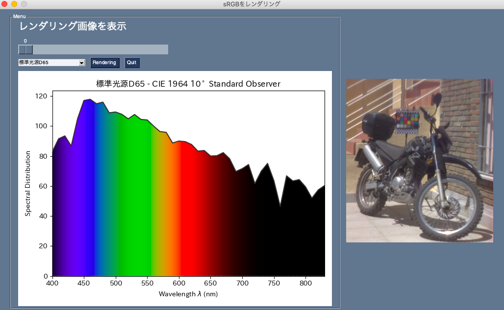

ハイパースペクトル画像の単一のチャネルを表示したり，RGB画像にレンダリングできるアプリケーションです．プログラムを実行したら400 nm ~ 410　nmのチャネルを表示しています．単一のチャンネルを表示することで，例えばカーラーチャートの黒色が全ての光の波長を反射しないことが確認できます．他にも赤色と知覚される620 nm〜750 nmの範囲でカラーチャートの赤色の部分が光を反射することがわかります．（黒色なら反射せず白色なら反射している．）また左には光源の分光分布を表示しています．

レンダリングに使用する光源としてCIEが決めたD65標準光源，標準光源Aと市販されている光源を二つ利用することができます．


使い方
tkinterをインストールします．
```
brew install tcl-tk
```
```
cd hyper_to_rgb
```
ハイパースペクトル画像をdata/の下にdata.tiffという名前で保存します．
```
curl -O http://colorimaginglab.ugr.es/pages/data/hyperspectral/scene9_sp/! ./data/data.tiff
```
実行方法
```
python3 main.py
```
# レンダリング方法
ハイパースペクトル画像からRGBへのレンダリング方法や現在抱いている疑問はに書きました．

# todo
光源の分光分布の画像が少し大きいように感じます．
また，アプリを全画面表示できないのも使いにくいため，改良したいと思います．

# リンク
スペインの大学で公開されているハイパースペクトル画像を利用します[1]．
光源A[2]と光源B[3]の値は市販されている光源の分光分布を配布しているサイトから入手しました．
[1]http://colorimaginglab.ugr.es/pages/Data#__doku_ishihara_spectral_database．
[2]http://galileo.graphycs.cegepsherbrooke.qc.ca/app/en/lamps/2602
[3]http://galileo.graphycs.cegepsherbrooke.qc.ca/app/en/lamps/2570


